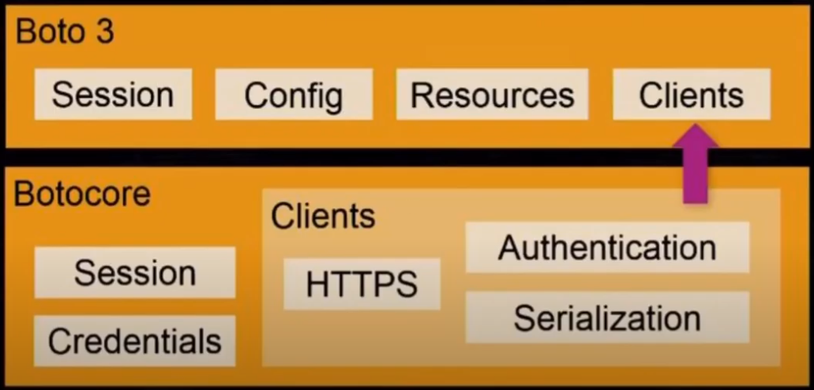

## Boto3

What consists of `boto3`? Namely,

- *Session*: store configurations, can create clients and resources, and boto3 creates default session.
- *Config*: config client-specific configurations that affect the behavior of your specific client object.
- *Resources*: object-oriented API for AWS, high-level service access recommended.
- *Clients*: expose botocore clients to developers for low-level service access.

*source: https://www.youtube.com/watch?v=Cb2czfCV4Dg&ab_channel=AmazonWebServices*

